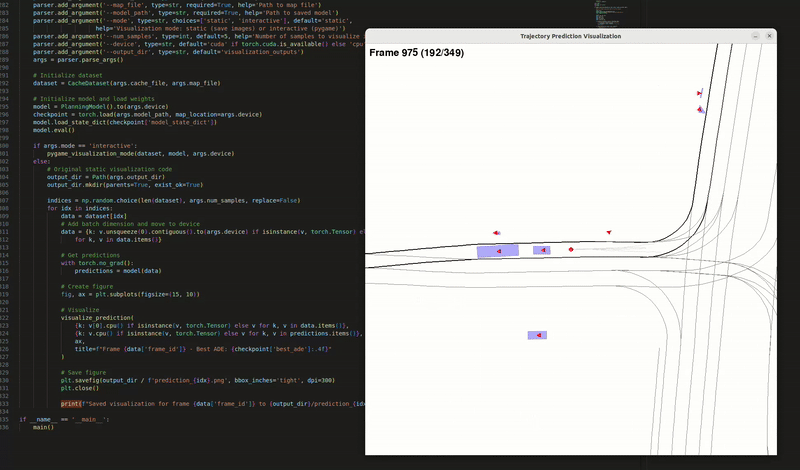

# naiveTF: Simplified Planning Transformer

## Overview

naiveTF is a lightweight implementation of a planning transformer model for autonomous driving that learns from recorded driving data. It's designed as a simplified version of planTF, removing dependencies on nuPlan, PyTorch Lightning, and other complex systems while maintaining core functionality.

The model learns to predict multi-modal future trajectories by processing agent states, map data, and historical trajectories extracted from ROS bags using the extract_bags tool.



## Features

- **Simplified Architecture**: Streamlined implementation of planning transformer with reduced dependencies
- **Multi-Modal Prediction**: Predicts multiple possible future trajectories with confidence scores
- **Map Understanding**: Processes lanelet2 map data for road network understanding
- **Agent Interaction**: Models interactions between the ego vehicle and surrounding agents
- **Trajectory Evaluation**: Computes ADE (Average Displacement Error) and FDE (Final Displacement Error) metrics

## Architecture

naiveTF consists of several key components:

1. **Agent Encoder**: Processes object states including position, velocity, and type
2. **Map Encoder**: Processes road network information from lanelet2 maps
3. **Transformer Encoder**: Fuses agent and map information using self-attention
4. **Trajectory Decoder**: Generates multi-modal trajectory predictions

The model uses Neighborhood Attention Transformer (NAT) for sequence encoding and standard transformer layers for cross-modal fusion.

## Requirements

- Python 3.6+
- PyTorch 1.8+
- Lanelet2 with Python bindings
- NATTEN (Neighborhood Attention Extension)
- timm
- numpy, scipy, matplotlib

## Installation

```bash
# Install PyTorch according to your CUDA version
pip install torch torchvision

# Install dependencies
pip install natten timm numpy scipy matplotlib tqdm

# Lanelet2 needs to be installed separately with Python bindings
# Follow Autoware Lanelet API's installation instructions for lanelet2
```

## Usage

### Training

```bash
source /home/ukenryu/map_test/lanelet2_python_api_for_autoware/setup.bash
python3 main.py --train_cache /home/ukenryu/map_test/lanelet2_python_api_for_autoware/extract_bags/caches \
    --val_cache /home/ukenryu/map_test/lanelet2_python_api_for_autoware/extract_bags/caches/cache.json \
    --map_file /home/ukenryu/autoware_map/odaiba_stable/lanelet2_map.osm \
    --epochs 90000  --lr 1e-4
```

### Inference

```bash
#!/bin/bash
source /home/ukenryu/map_test/lanelet2_python_api_for_autoware/setup.bash
python3 test_and_visualize.py \
    --cache_file /home/ukenryu/map_test/lanelet2_python_api_for_autoware/extract_bags/caches/cache.json \
    --map_file /home/ukenryu/autoware_map/odaiba_stable/lanelet2_map.osm \
    --model_path /home/ukenryu/map_test/lanelet2_python_api_for_autoware/naiveTF/outputs/best_model.pth \
    --num_samples 5 \
    --output_dir visualization_outputs \
    --mode interactive
```

## Data Format

naiveTF expects data in a specific JSON format produced by the Data Extraction Engine tool:

```python
"""
Json file structure:
  str(frame_id) {
    frame: frame,
    objects: [
        {
            "id": object_id,
            "type": object_type as long,
            "transform": T [4, 4], - transform of the object in the world frame.
            "velocity": v [3], - velocity of the object in the world frame.
            "global_footprint": [4, 3] - footprint of the object in the world frame.
        },
        {},
    ],
    history_trajectories_transform_list: [N_h, 4, 4], past trajectory of the vehicle in the world frame. N=10,
    future_trajectories_transform_list: [N_f, 4, 4], future trajectory of the vehicle in the world frame. N=30,
    history_trajectories_speed_list: [N_h, 3], past speed of the vehicle in the world frame. N=10,
    future_trajectories_speed_list: [N_f, 3], future speed of the vehicle in the world frame. N=30,
    routes: [], list of lanelet2 id that is route of the vehicle in the neighborhood.
    nearby_lanelets_ids: [], list of lanelet2 id that is nearby the vehicle in the neighborhood.
  }
"""
```

## Key Components

### Layers

- **transformer_encoder_layer.py**: Standard transformer encoder implementation
- **embedding.py**: Contains NAT (Neighborhood Attention Transformer) for sequence encoding
- **common_layers.py**: Utility functions for building MLPs and other common layers

### Modules

- **agent_encoder.py**: Encodes agent states and history
- **map_encoder.py**: Processes map elements
- **trajectory_decoder.py**: Generates multi-modal trajectory predictions


## Differences from planTF

- Removed dependency on nuPlan dataset format
- Removed PyTorch Lightning training framework
- Simplified position embeddings
- Streamlined architecture with fewer layers
- Direct integration with lanelet2 maps instead of vectorized representations
- Custom dataset implementation for cached ROS bag data

## Acknowledgements

This project is a simplified version of planTF, adapted to work with extracted Pilot-Auto ROS bag data instead of nuPlan.

